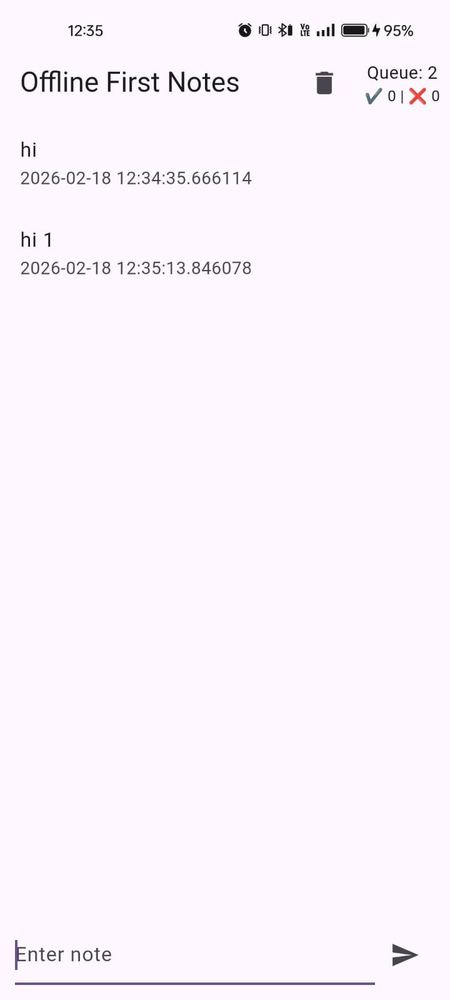
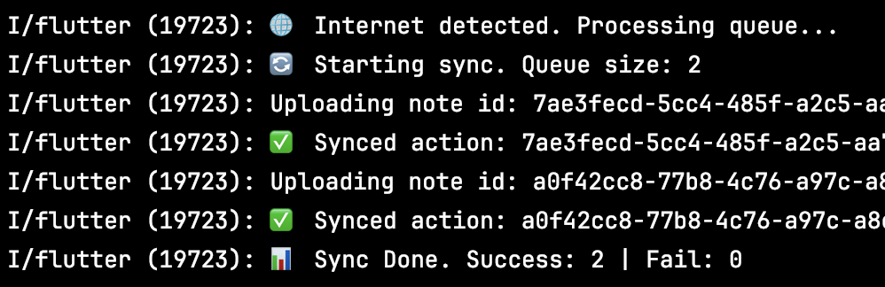
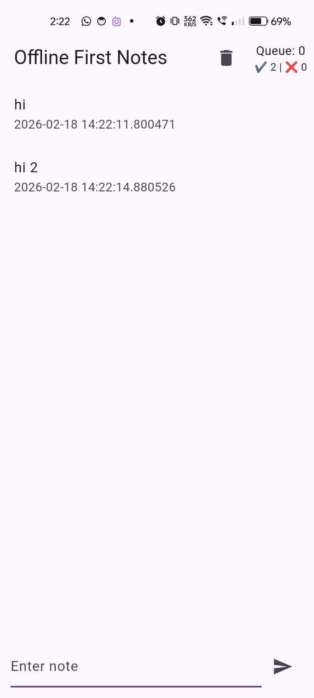
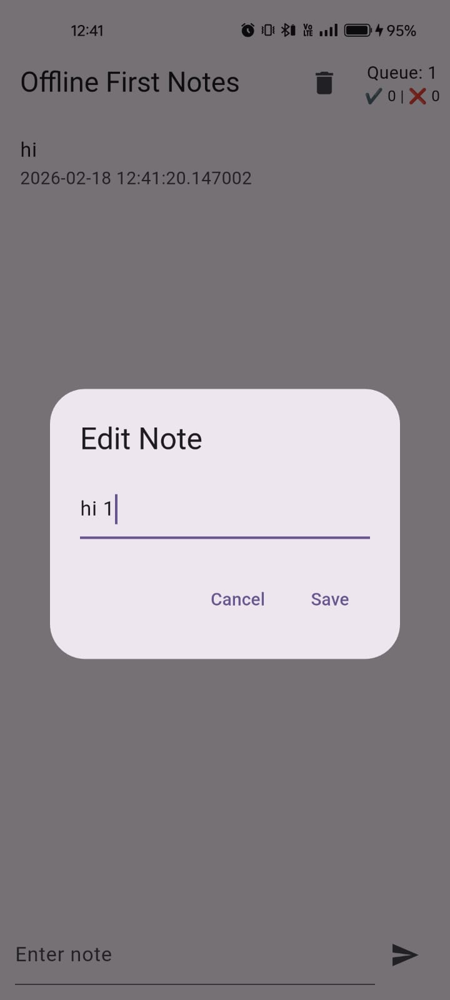
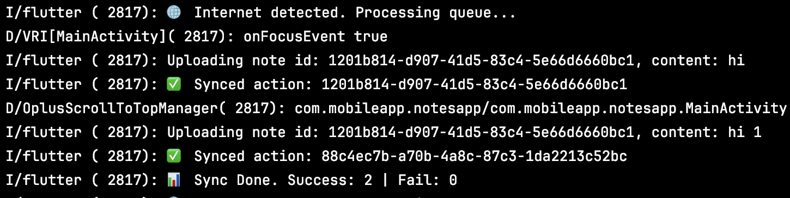
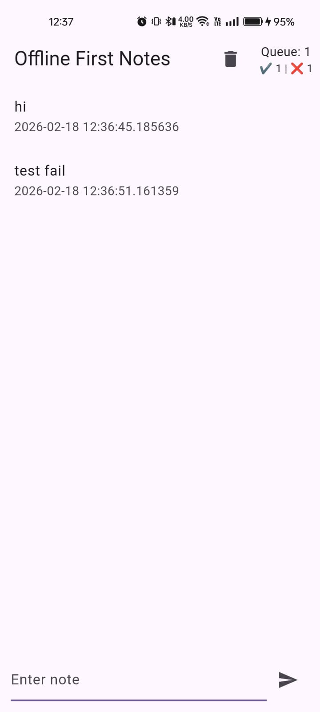
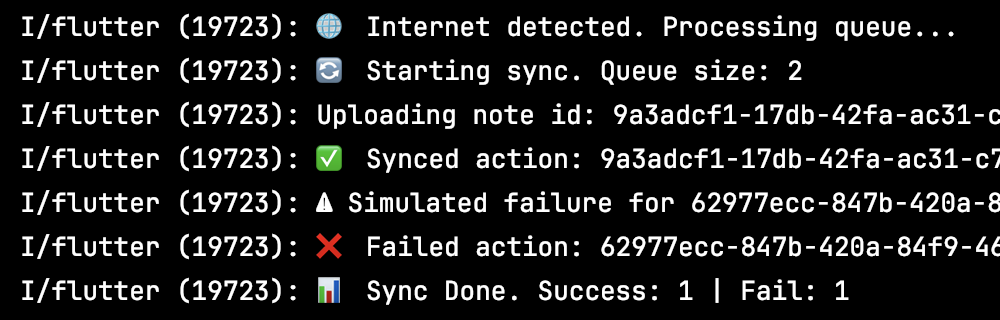

# 📝 Offline-First Notes App

A Flutter application demonstrating an offline-first architecture with a durable sync queue, retry logic, idempotent operations, and Firebase Firestore backend.

---

## 📱 App Overview

This project implements:

- ✅ Local-first UI (instant cached reads)
- ✅ Offline note creation & editing
- ✅ Persistent sync queue using Hive
- ✅ Retry mechanism with backoff
- ✅ Idempotent Firestore writes
- ✅ Conflict handling (Last-Write-Wins)
- ✅ Observability (queue size + success/failure counters)

---

## 🖼 App Screenshots (Point on image  to view/open in assets)

### 🏠 Home Screen


### Offline Add -Added two notes (Internet off) 

### Offline Add -Two notes sync started and uploaded to Firestore(Internet on)

### Offline Add -Tow notes succesfully added to Firestore (Succes =2)


### ✏ Offline Edit (Queue Increases)
### Offline Edit-Edited Already existed note (Internet off)

### Offline Edit-Overwrote the previous note "hi" to "hi 1" (Internet ON)


### 🔄 Retry Simulation Logs
### Retry Logs-Added two notes,,Fail test and succes test

### Retry Logs-Succes 1 and failed 1(note contains "fail" for first try) (Internet on)



---

## 🏗 Architecture

```
UI (Flutter + Provider)
        ↓
NotesRepository
        ↓
LocalStorageService (Hive)
        ↓
SyncQueueService
        ↓
FirebaseService (Firestore)
```

---

## 🚀 Features Implemented

### 1️⃣ Local-First UX

- Notes load instantly from Hive.
- Firestore refresh happens in background.
- 5-minute TTL cache implemented.

---

### 2️⃣ Offline Writes

- Add note offline
- Edit note offline
- Actions stored in Hive sync queue
- Queue survives app restart

---

### 3️⃣ Durable Sync Queue (FIFO)

Each action includes:

- `actionId` (idempotency key)
- `retryCount`
- `createdAt` timestamp

Queue is sorted by timestamp to preserve execution order.

---

### 4️⃣ Idempotent Operations

An operation is **idempotent** if executing it multiple times produces the same final result.

In this app:

- Firestore document ID = `note.id`
- `.set()` overwrites the same document
- Retry does NOT create duplicates

---

### 5️⃣ Retry Strategy

- Retry once
- 2-second backoff delay
- Retry survives restart
- Simulated transient failure using keyword `"fail"`

---

### 6️⃣ Conflict Strategy

**Last Write Wins**

- Same document ID used for updates
- Latest update overwrites previous value
- Suitable for single-user notes application

---

### 7️⃣ Observability

- Queue size displayed in UI
- Success & Failure counters displayed
- Sync logs printed in console
- Metrics persisted using Hive

---

## 🧪 Test Scenarios

### Scenario 1 – Offline Add

1. Turn off internet
2. Add note
3. Queue increases
4. Turn internet on
5. Sync completes

---

### Scenario 2 – Offline Edit

1. Turn off internet
2. Edit note
3. Queue increases
4. Turn internet on
5. Firestore reflects latest update

---

### Scenario 3 – Retry Simulation

1. Add note containing `"fail"`
2. First attempt fails
3. Retry succeeds
4. No duplicate document created

---

## ⚙ Tech Stack

- Flutter
- Provider
- Hive (local storage)
- Firebase Firestore
- Connectivity Plus

---

## 📦 Getting Started

```bash
flutter pub get
flutter run
```

---

## 📘 Notes

This project demonstrates production-minded offline-first design including:

- Durable queue
- Safe retries
- Conflict handling
- Idempotency
- Observability
